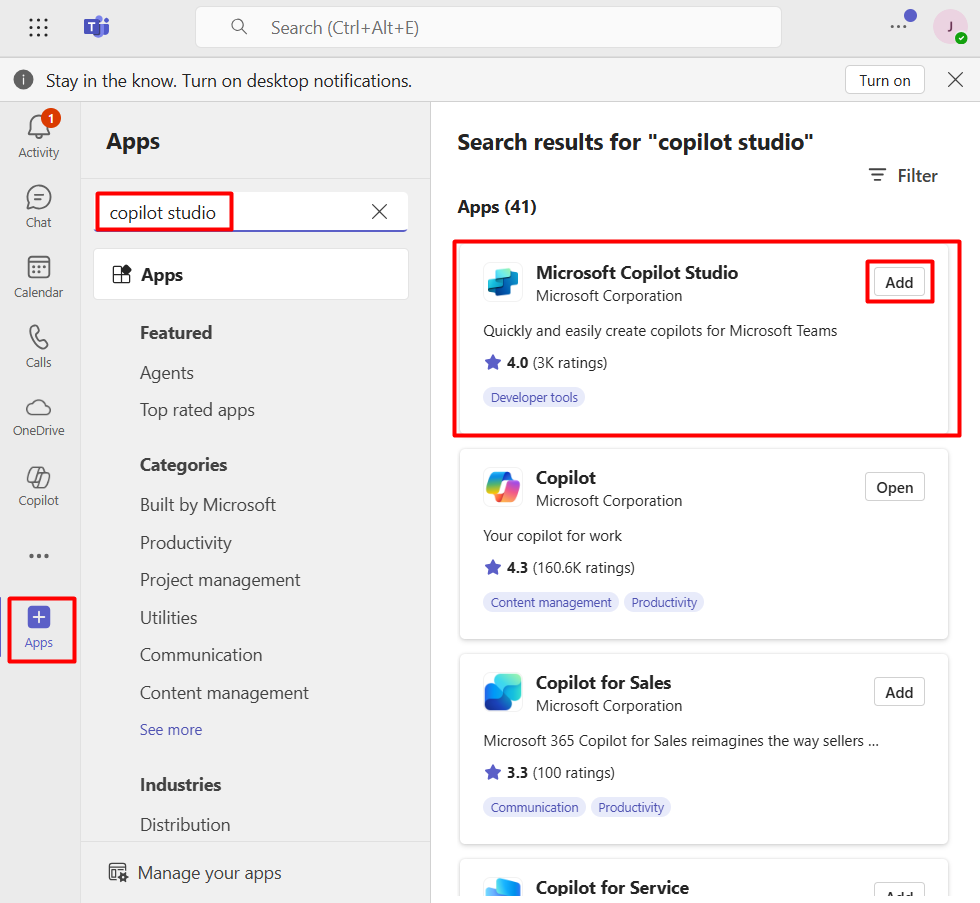
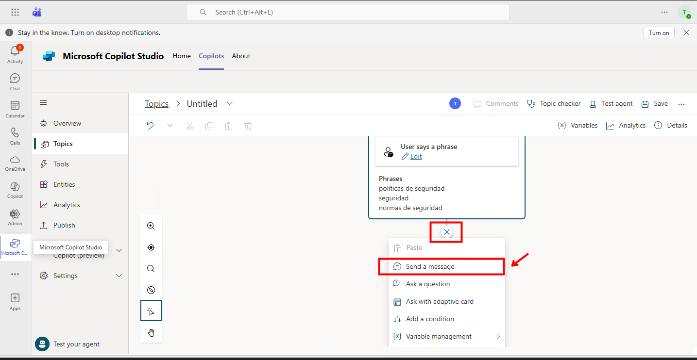
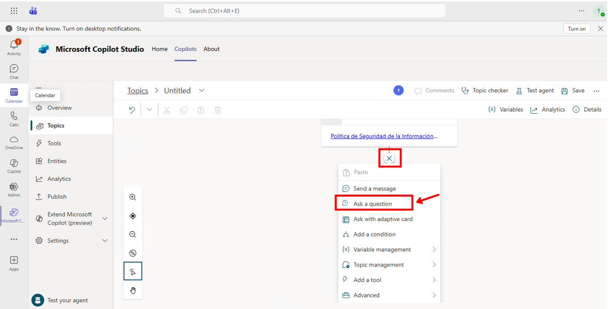

#  Crea agentes en el Copilot Studio de Teams

## Objetivo de la práctica:
Al finalizar la práctica, serás capaz de:
- Identificar el uso de Copilot Studio en Teams
- Identificar las limitantes en Copilot Studio en Teams
- Identificar las caracteristicas de seguridad de los agentes clásicos de Copilot Studio en Teams

## Diagrama del laboratorio 
El siguiente diagrama resume visualmente lo que realizarás a lo largo de la siguiente práctica. 

## Duración aproximada:
- 35 minutos.

## Instrucciones 
La creación de agentes clásicos en Microsoft Teams consiste en configurar bots que interactúan con los usuarios mediante mensajes, comandos o tarjetas adaptativas. Estos agentes se desarrollan utilizando herramientas como el Microsoft Bot Framework y se integran a través de Azure Bot Services. Su función principal es automatizar tareas, responder preguntas frecuentes o facilitar procesos dentro del entorno colaborativo de Teams, utilizando flujos de conversación predefinidos y conectores a servicios externos.

En el siguiente ejercicio, diseñarás un agente capaz de interactuar contigo en temas personalizados. Este agente podrá ejecutar acciones automáticamente, como enviar correos electrónicos, lo que te permitirá experimentar cómo se construyen soluciones inteligentes que mejoran la productividad y la comunicación dentro de Teams.

### Tarea 1. Acceder a Copilot Studio en Teams.

**Paso 1.** Ingresar a Teams

Ingresa en tu navegador a [Mircosoft Teams](https://teams.microsoft.com/) usando el siguiente link: `https://teams.microsoft.com/`, y usa las credenciales otorgadas por el instructor. Si aparece alguna ventana emergente o de bienvenida ciérrala. 

---

**Paso 2.** Instala Copilot Studio

En el panel izquierdo, haz clic en Apps y luego usa la barra de búsqueda para encontrar `Microsoft Copilot Studio`. Al encontrarlo selecciona el botón ***Add***.

---

**Paso 3.** Verifica los permisos
En la ventana emergente ubica la pestaña ***Permisos*** y revisa los permisos listados, una vez hecho esto, haz clic en el botón **Add** y posteriormente en el botón **Open** de la ventana de confirmación de aplicación añadida.

---

**Paso 4.** Verificación de interfaz web

Seguramente recibirás una recomendación para el uso de la app de escritorio, por propósitos de nuestro laboratorio continuaremos en la interfaz web seleccione "Show the app anyway". 

### Tarea 2. Crear un equipo en Teams

**Paso 1.** Para poder crear un asistente en Teams, antes debes elegir o crear un equipo. Regresa a la opción de chat del costado izquierdo, selecciona "See all your teams" vera al centro en la sección "Your Teams and channels" un listado de sólo un equipo, después en el apartado superior derecho haz clic en **Create team ▾** y luego seleccionan **create team**.

---

**Paso 2.** Crea un nuevo equipo configurando los siguientes parámetros:

* **Team name:** Netec(xy) **cambie la xy por su número de usuario que se le asigno**
* **First channel name:** General

Y luego haz clic en el botón **Create**.

En este caso, vamos a omitir los miembros al equipo, por lo cual, en la siguiente ventana haz clic en **Skip**.

### Creación del agente

**Paso 1.** Regresa nuevamente a la aplicación **Copilot Studio** que previamente añadiste a Mircosoft Teams.

Abre la interfaz haciendo clic en el botón **Start now**.

Nota: si aparece la ventana emergente  "This app may have issues in the web version of Teams" seleccione "Show the app anyway"

---

**Paso 2.** Verás una ventana que te solicita seleccionar un equipo para iniciar, selecciona el equipo que creaste previamente: **Netec(xy)**. Esto abrirá una ventana donde te dice que se está creando el chatbot de clic al botón "Continue", después otro clic en **Close**.

---
**Paso 3.** En la interfaz de Microsoft Copilot seleccione la pestaña Copilots, después observe en el costado izquierdo debajo de **"My copilots"** debe estar el nombre de tu equipo **Netec(xy)**, y con el equipo seleccionado debes tener la opción **+New copilot**, haz clic sobre esta última opción

---

**Paso 4.** Lo primero que vamos a hacer es editar el idioma del agente, haz clic en **Edit language**, y luego busca y selecciona **Spanish (es-ES)**.

---

**Paso 5.** En la sección **Name** ingrese NetecBot como nombre y de clic al botón **Create**.

**Paso 7.** En la ventana emergente escribe el siguiente mensaje: `Hola`, y presiona Enter. La respuesta generada hace parte de un tema preconfigurado, haz clic sobre la respuesta del agente en la ventana del **Test bot**, esto abrirá el tema del que se devolvió la respuesta, en este caso **¿Qué tal?**.

---

**Paso 8**. Observa que el tema tiene un conjunto de mensajes predefinidos que puedes editar, eliminar o añadir nuevos mensajes.

En la sección del Tema "Message" elimine el mensaje que esta por default después de clic en +Add  y seleccione la opción Message variation después cambiarás la respuesta preconfigurada por: ¡Hola! Soy NetecBot, su asistente virtual. Puedo ayudar con preguntas de las políticas de seguridad de la empresa.

finalmente de clic en el botón **Save**.

---

**Paso 9.** Nuevamente escribe `Hola`, y verifica que la respuesta generada sea la misma que configuraste previamente. 

---

**Paso 10.** Ahora vamos a crear un nuevo tema, cierra la ventana del **Test Bot**, selecciona la opción **Topics** del costado izquierdo y haz clic en el botón **+ New topic** > **From blank**.

---

**Paso 11.** Configura el nuevo tema con los siguientes parámetros:
* **Name:** Políticas de seguridad
* **Trigger phrases:** políticas de seguridad, seguridad, normas de seguridad, etc.

Luego cierra la ventana de las **Trigger phrases**.

---

**Paso 12.** Agrega un nuevo nodo conversacional de **Show a message** y en la sección **Messages**, escribe: `Actualmente le puedo dar apoyo con las siguiente políticas de seguridad`. 

Luego haz clic nuevamente en la cruz **+** y selecciona nuevamente **Show a message**.

---

**Paso 13.** En la sección **Messages**, escribe las siguiente opciones usando la opción de viñetas: 
* Política de Seguridad de la Información
* Política de Uso Aceptable de Tecnología
* Política de Respaldo y Recuperación
* Política de Identidad y Acceso
* Política de Concientización y Capacitación en Seguridad

 A cada opción, agrega un vínculo usando la opción que tiene un ícono de una cadena. Los vínculos a agregar son los siguientes:

 | Opción | Vínculo |
| --- | --- |
| Política de Seguridad de la Información | https://aznetecgroup29-my.sharepoint.com/:w:/g/personal/azstudent29_aznetecgroup29_onmicrosoft_com/ESEo-WtwPQ5InbSjhodc08wBBeXHeN1UVLCiJOAcLO_slg?e=Hmo9R0 |
| Política de Uso Aceptable de Tecnología | https://aznetecgroup29-my.sharepoint.com/:w:/g/personal/azstudent29_aznetecgroup29_onmicrosoft_com/EawxZNlG-oVNiYFe_dGPSTYBT1miyw1CkvGI-pHoUbuifg?e=mqPvG5 |
| Política de Respaldo y Recuperación | https://aznetecgroup29-my.sharepoint.com/:w:/g/personal/azstudent29_aznetecgroup29_onmicrosoft_com/Edawx6RgH29ArSpN2_O0QaIB8Xi58JWgSpvdYBx5HxJQrw?e=OTsr1y |
| Política de Identidad y Acceso | https://aznetecgroup29-my.sharepoint.com/:w:/g/personal/azstudent29_aznetecgroup29_onmicrosoft_com/Ec4T0DMUQWlHtIeyOgljpGkBfj_NLJJjCE2mbD73Dy_05Q?e=wgDI98 |
| Política de Identidad y Acceso | https://aznetecgroup29-my.sharepoint.com/:w:/g/personal/azstudent29_aznetecgroup29_onmicrosoft_com/EdPAfbokR5RIoah6jiGVGGgBRA3w8AP7kZN1jS9H0hebPw?e=hmpft9 |

Luego haz clic en el botón **check** por cada vínculo agregado.

---

**Paso 14.** Debajo del mensaje hacemos nuevamente clic en **+** y selecciona **Formular una pregunta**.

---

**Paso 15.** Configura la pregunta con los siguientes parámetros:
* **Formular una pregunta** ¿Quieres que te envíe las políticas por correo electrónico?
* **Identificar** Booleano
* **Guardar respuesta como**: Haz clic en el ícono del ***lapiz***, y luego configura el nombre a `Decisión`, cierra la ventana de **Propiedades de variables**.

---

**Paso 16.** Haz clic en el botón **+** debajo de la pregunta y selecciona **Agregar una condición**.

---

**Paso 17.** Configura la condición de la izquierda con los siguientes parámetros:
* Variable: `Decisión`
* Valor lógico **es igual a**
* Valor `True`

---

**Paso 18.** En la rama **If true**, haz clic en el botón **+** y selecciona **Formular una pregunta**.

---

**Paso 19.** Configura la pregunta con los siguientes parámetros:
* **Formular una pregunta** Selecciona la política
* **Identificar** Opciones de preguntas de tipo test
* **Opciones** Política de Seguridad de la Información, Política de Concietización y capacitación, Política de Identidad y acceso

**Nota:** ***Para este ejemplo sólo agregaremos esas tres***

Cambia el nombre de la variable de la respuesta almacenada para esa pregunta a: `Respuesta`.

---

**Paso 20.** Haz clic en el botón **+** debajo de la rama para la opción ***Política de Seguridad de la Información*** y selecciona **Llamar a una herramienta**. Luego, selecciona **Crea un flujo**.

---

**Paso 21.** Esto abrirá un conjunto de plantillas de Power Automate. Tómate un momento para verificar algunas, y luego selecciona **Enviar un mensaje de correo electrónico de Outlook**. Otorga permisos al conector Office 365 Outlook, haciendo clic en **Iniciar sesión**

---

**Paso 22.** El flujo prácticamente está creado, sólo debemos hacer algunos ajustes. Haz clic en la acción: **Send an email (V2)**

---

**Paso 23.** Quita el valor dinámico ***Body*** del cuerpo del correo, y reemplazalo por el siguiente mensaje estático:

>`¡Hola!`
>
>`De acuerdo a tu solicitud, a continuación envío la ruta donde se encuentran las políticas de seguridad, si no tienes acceso no dudes en comunicarte con tu administrador.`
>
>`https://aznetecgroup29-my.sharepoint.com/:f:/g/personal/azstudent29_aznetecgroup29_onmicrosoft_com/EjiYFXC_g45Hg2xzfil_dZwBrJMBhxYS462pMXtWDfE9RQ?e=RDqEpO`
>
>`Saludos`

---

**Paso 24.** En la acción **Return value(s) to Power Virtual Agents** Elimina **Boby**

---

**Paso 25.** En el trigger **Power Virtual Agents** Elimina **Boby**.

---

**Paso 26.** Haz clic en el botón **Guardar**, para guardar tu flujo automatizado.

---

**Paso 27.** Regresa a la pestaña del navegador donde tienes abierto **Copilot Studio**, y antes de agregar el flujo, agrega un nodo de **Formular una pregunta**.

---

**Paso 28.** Configura la pregunta con los siguientes parámetros:

* **Formular una pregunta** Por favor, ingresa tu correo electrónico.
* **Identificar** Respuesta completa del usuario
* **Guardar respuesta como**: Haz clic en el ícono del ***lapiz***, y luego configura el nombre a `Correo`, cierra la ventana de **Propiedades de variables**.

---

**Paso 29.** Ahora sí, haz clic en el botón **+** debajo de la pregunta anterior y selecciona **Llamar a una herramienta**. Luego, selecciona el flujo que acabas de crear.

---

**Paso 30.** En el campo **To**, selecciona la variable `Correo` que creaste en la pregunta anterior. En el campo **Subject**, selecciona la variable `Respuesta` que creaste anteriormente.

---

**Paso 31.** Agrega un nuevo mensaje que contenga el siguiente texto:

`he enviado un correo electrónico con la información de las políticas`

Luego finaliza agregando un nuevo nodo de tipo **Redirigir a otro tema**, y selecciona **Fin de la conversación**

---

**Paso 32.** Vamos a dejarlo así, haz clic en el botón de **Guardar** del costado superior derecho. 

---

**Paso 33.** Ahora haz clic en el botón **Test your chatbot** del costado inferior izquierdo.

---

**Paso 34.** En la ventana emergente escribe el siguiente mensaje: `políticas de seguridad`, y presiona Enter. Prueba el flujo de tu conversación libremente. 

---

**Paso 35.** Haz clic en el botón **Publicar** del costado izquierdo. Y en la ventana que se abre, nuecamente en el botón central **Publicar**

---

**Paso 36.** Haz clic **Opciones de disponibilidad**

---

**Paso 37.** Llevalo al equipo que creaste inicialmente haciendo clic en **Agregar a Netec** y luego en **Agregar**.

---

**Paso 38.** El bot te saludará en un ventana de chat. 

### Resultado esperado

Interactua con el chat desde Teams. Sigue el flujo de conversación, debes recibir toda la información que configuraste previamente, así como el correo electrónico. 

**Nota:** Si el agente no te contesta en la ventana de chat, intenta buscar la app desde Teams que lleva por nombre **NetecBot**. 

