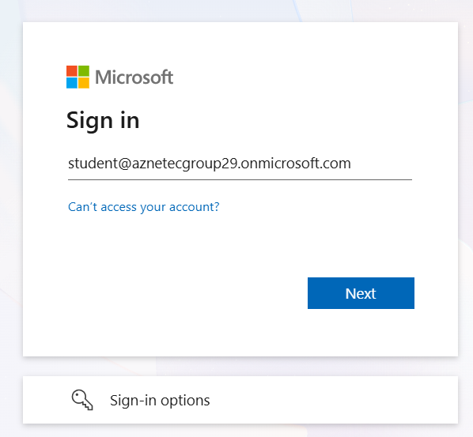
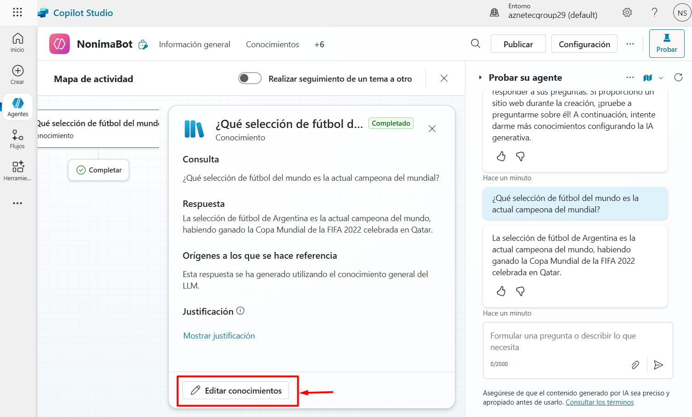
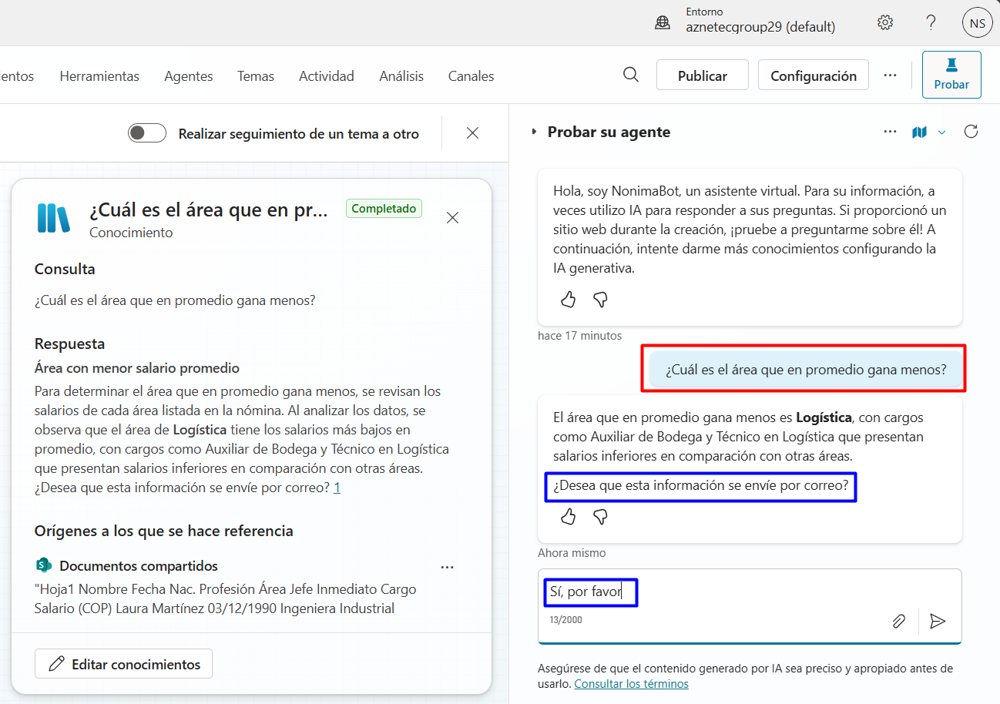

#  Crea agentes en el Copilot Studio integrando tus datos e IA Gen

## Objetivo de la práctica:
Al finalizar la práctica, serás capaz de:
- Crear y configurar un agente personalizado en Copilot Studio integrando datos empresariales desde SharePoint y ajustando sus respuestas mediante instrucciones específicas.
- Aplicar opciones de seguridad y autenticación para controlar el acceso y proteger la información gestionada por el agente.
- Configurar acciones automatizadas usando conectores, como el envío de correos electrónicos a través de Outlook, y establecer reglas para asegurar el flujo seguro de información.

## Diagrama del laboratorio 
El siguiente diagrama resume visualmente lo que realizarás a lo largo de la siguiente práctica. 

## Duración aproximada:
- 35 minutos.

## Instrucciones 
La creación de agentes con Copilot Studio permite diseñar asistentes inteligentes que interactúan de forma natural con los usuarios, automatizan tareas y aprovechan el poder de la inteligencia artificial generativa. Estos agentes pueden integrarse con los datos propios de la organización, como archivos, bases de conocimiento o sitios de SharePoint, para ofrecer respuestas contextualizadas y precisas. Además, Copilot Studio ofrece controles de seguridad robustos, como la inspección de contenido, la gestión de permisos y el monitoreo de actividad, lo que garantiza que las acciones generadas por IA se mantengan dentro de los límites definidos por la organización. Gracias a su compatibilidad con conectores y herramientas externas, los agentes pueden ejecutar acciones como enviar correos, actualizar registros o activar flujos de trabajo, todo de forma segura y controlada.

En este laboratorio realizarás la creación de un agente personalizado dentro de Copilot Studio. Accederás a la plataforma, crearás un nuevo agente desde cero y explorarás las opciones de seguridad disponibles, como el control de acceso y la inspección de prompts. Luego, añadirás datos desde un sitio de SharePoint para enriquecer las respuestas del agente con información interna de la organización. También utilizarás un conector de Outlook para enviar un correo electrónico como acción generada por el agente, y configurarás una regla de seguridad que permita el acceso restringido a dichos correos, asegurando que solo usuarios autorizados puedan recibirlos. Esta práctica te permitirá comprender cómo combinar IA, datos empresariales y políticas de seguridad en un entorno real.

### Tarea 1. Acceder a Copilot Studio.

**Paso 1.** Desde tu navegador ingresa a [Copilot Studio](https://web.powerva.microsoft.com/) usando el siguiente link: `https://web.powerva.microsoft.com/`, y usa las credenciales otorgadas por el instructor. 

---

**Paso 2.** En la ventana emergente que aparece selecciona tu país y haz clic en el botón **Start free trial**.

---

**Paso 3.** Si te aparece una ventana de bienvenida haz clic en el botón **Skip**.

### Tarea 2. Crear un agente en Copilot Studio.

**Paso 1.** En el menú lateral izquierdo haz clic en la opción **Agentes**. Luego, selecciona **+ Nuevo agente**

---

**Paso 2.** Hay dos formas de crear agentes en Copilot Studio, describiéndolo o configurándolo manualmente. Dejando la pestaña seleccionada **Describir**, envíale el siguiente prompt al copiloto:

`Otorgar información acerca de la nómina a los usuarios del área de Recursos humanos.`

Luego, haz clic en el botón **Enviar**.

---

**Paso 3.** El copiloto generará una descripción del agente. Ahora te solicitará el nombre del agente, en nuestro caso será `NominaBot`.

---

**Paso 4.** Vas a darle más contexto de lo que podrá hacer, envíale el siguiente prompt:

`Debes contestar preguntas respecto a los datos de nómina que se encuentran cargados en la base de conocimientos. Por ejemplo, "¿qué área tiene el salario más alto?", "¿La diferencia entre salarios de una misma área es muy amplía?`

Luego, haz clic en el botón **Enviar**.

---

**Paso 5.** Ahora, cambia a la pestaña **Configurar**.

---

**Paso 6.** Fíjate cómo se configuró automáticamente tu agente, echa un vistazo por las demás configuraciones que puedes cambiar, sin hacer modificación alguna. Luego, haz clic en el botón **Crear**.

### Tarea 3. Configuraciones de modelos de IA y seguridad

**Paso 1.** Una vez creado el agente, en la pestaña **Información general** haz clic en los tres puntos **(...)** frente al modelo del agente y luego en **Editar**.

---

**Paso 2.** Algunas características están deshabilitadas, sin embargo, exploralas. Mira los modelos de lenguaje disponibles.

---

**Paso 3.** Cambia a la pestaña **Seguridad** y observa las opciones disponibles. Haz clic en la opción **Autenticación**.

---

**Paso 4.** Observa las opciones de autenticación disponibles. 

Copilot Studio ofrece tres opciones de autenticación para agentes, cada una adaptada a distintos niveles de seguridad y canales:
1. Sin autenticación: El agente está disponible públicamente en cualquier canal, sin requerir verificación de identidad.

2. Autenticar con Microsoft: Usa Entra ID para validar usuarios en entornos como Teams, SharePoint, Power Apps o Microsoft 365 Copilot.

3. Autenticar manualmente: Permite configurar autenticación personalizada con cualquier proveedor OAuth2, como Google o Facebook, para cualquier canal.

Luego, haz clic en el botón **Cancelar**.

---

**Paso 5.** Ahora, haz clic en la opción **Seguridad del canal web**.

---

**Paso 6.** Observa las opciones de seguridad del canal web.

La seguridad del canal web en Copilot Studio permite proteger el acceso a los agentes mediante secretos, tokens y autenticación personalizada.

Cuando se habilita esta seguridad, se puede restringir el uso del agente en sitios web o canales Direct Line, exigiendo que cada solicitud incluya un secreto o token válido. Esto evita accesos no autorizados y garantiza que solo los clientes autenticados puedan interactuar con el agente. Además, al activar la opción de acceso protegido, el sitio web de demostración y otros canales sin credenciales se tratan como dispositivos restringidos, reforzando el control de acceso y la integridad de las conversaciones.

Luego, haz clic en el botón **Cancelar**.

---

**Paso 7.** Cambia a la pestaña **Detalles del agente**, cambia el nombre de tu agente por `NominaBot` y haz clic en el botón **Guardar**.

Mira cómo ahora sí el saludo inicial del agente en la ventana de prueba incluye el nombre. 

### Tarea 4. Parametrizar correctamente el agente

**Paso 1.** Usando la ventana de chat de prueba del agente, envíale el siguiente prompt:

`¿Qué selección de fútbol es la actual campeona del mundial?`

---

**Paso 2.** Observa la respuesta del agente. Está abierto a cualquier tipo de pregunta y cotexto. Además, fíjate que la ventana de chat de prueba está acompañado por un mapa de actividad que te va indicando el procesamiento de cada respuesta. 

---

**Paso 3.** No queremos que las respuestas sean abiertas, para lograr reducir el conocimiento, debemos agregarle el nuestro. En el mapa de actividad haz clic en la opicón **Editar conocimientos**. Si por algún motivo no te sale está opción, puedes hacer clic en la pestaña **conocimientos** de la parte superior. 

---

**Paso 4.** En la ventana de conocimientos haz clic en el botón **+ Agregar conocimiento**.

---

**Paso 5.** Selecciona la opción **SharePoint**.

---

**Paso 6.** En esta ventana vas a agregar el siguiente sitio de SharePoint:

`https://aznetecgroup29.sharepoint.com/sites/RRHH/Documentos%20compartidos`

Tendrás un mensaje de advertencia, dado que no tienes acceso aún a este sitio. 

---

**Paso 7.** Abre una nueva ventana en el navegador y abre el sitio de SharePoint con la misma URL: `https://aznetecgroup29.sharepoint.com/sites/RRHH/Documentos%20compartidos`, y haz clic en el botón **Request access**

> **IMPORTANTE:** Informa a tu instructor que acabas de solicitar permisos para acceder al sitio de SharePoint, él(la) te dará acceso. 

---

**Paso 8.** Regresa a la ventana de Copilot Studio, **NO** agregues el sitio hasta que ya no te aparezca el mensaje de advertencia. Cuando esto ocurra, haz clic en el botón **Agregar**, y cuando ya veas listado el sitio haz clic en **Agregar al agente**.

>***NOTA: Si agregas el sitio con la advertencia aún, tendrás problemas con los siguientes pasos del laboratorio.***

---

**Paso 9.** Ahora, en la pestaña de **Información general** harás clic en el botón **Editar** de la sección ***Instrucciones***.

---

**Paso 10.** Agrega las siguientes instrucciones al principio:

`Sólo debes contestar preguntas acerca de la nómina de la empresa, que están en el documento adjunto. Si te hacen preguntas fuera de este contexto debes contestar; "Lo siento, no puedo ayudarte con eso."` y haz clic en **Guardar**.

---

**Paso 11.** Ahora, en la ventana de chat de prueba del agente, envíale nuevamente el siguiente prompt:

`¿Qué selección de fútbol es la actual campeona del mundial?`

---

**Paso 12.** Observa la respuesta del agente. Ya no responde preguntas por fuera de contexto.

Hazle la siguiente pregunta:

`¿Cuál es el colaborador que más gana en la organización?`

Si quieres validar que la respuesta sea correcta, dirigete al sitio de SharePoint antes mencionado (en este punto del laboratorio ya deberías tener acceso), ingresa a Documentos y accede al documento en Excel que se encuentra allí. 

---

**Paso 13.** El problema ahora es que está dando nombres propios, vamos a modificar esto en las instrucciones. 

Regresa a la pestaña de **Información general** y haz clic nuvamente en **Editar** de la sección ***Instrucciones***. 

Agrega la siguiente instrucción al inicio:

`No debes dar nombres propios de los colaboradores, esa información debe ser confidencial`.

Luego, haz clic en el botón **Guardar**.

---

**Paso 14.** En la ventana de chat de prueba del agente, envíale nuevamente el siguiente prompt:

`¿Cuál es el colaborador que más gana en la organización?`

Observa que ahora no da nombres propios.

### Tarea 5. Configurar una acción con un conector

**Paso 1.** Cambia a la pestaña **Herramientas** y haz clic en el botón **+ Agregar herramienta**.

---

**Paso 2.** Tómate un momento para ver las herramientas disponibles. Selecciona el conector **Office 365 Outlook**.

---

**Paso 3.** En la siguiente ventana aparecen todas las acciones permitidas para este conector, tómate un momento para verlas, y selecciona **Enviar correo electrónico (V2)**.

---

**Paso 4.** En la siguiente ventana haz clic en la opción **No conectado** y luego en **Crear una nueva conexión**.

---

**Paso 5.** Ahora, en la siguiente ventana haz clic en el botón **Crear**.

---

**Paso 6.** Posiblemente te solicite nuevamente realizar un proceso de autenticación, de ser así hazlo, de lo contrario para al paso siguiente.

---

**Paso 7.** Una vez autenticado, haz clic en **Agregar y configurar**.

---

**Paso 8.** Ahora tienes una nueva herramienta para el agente en cuestión. Baja a la sección ***Entradas***, y fíjate que tanto el destinatario, como el asunto y el cuerpo del correo serán elegidos por el modelo de lenguaje, si bien, es posible personalizar estos parámetros, para este ejercicio los dejaremos así. 

---

**Paso 9.** Cambia a la pestaña **Información general** y haz clic en el botón **Editar** de la sección ***Instrucciones***.

---

**Paso 10.** Agrega la siguiente instrucción al final de la que ya habías puesto manualmente, pero antes de la que ya estaba configurada:

`Si el usuario realiza una pregunta dentro del contexto del archivo de nómina, darás la respuesta acorde y preguntarás si desea que esa información se envíe por correo, de recibir una respuesta afirmativa procederás a enviarlo, de lo contrario le preguntarás si hay algo más en lo que desea que le ayudes.`

Luego, haz clic en **Guardar**.

---

**Paso 11.** Nuevamente en la ventana de chat de prueba del agente, envíale el siguiente prompt:

`¿Cuál es el área que en promedio gana menos?`

Luego, dile que sí quieres que te envíe esta información por correo. 

---

**Paso 12.** Revisa el mensaje de advertencia en la solicitud de autorización, haz clic en **Permitir**.

---

**Paso 13.** Ahora, revisa el correo de la cuenta con la que te autenticastes en el conector, deberías tener un nuevo correo con la información solicitada.

---

**Paso 14.** Este error 550 5.7.708 indica que el servidor de correo de Microsoft rechazó el mensaje porque no acepta tráfico desde la dirección IP desde la que se intentó enviar el correo. Específicamente, significa:
* "Access denied, traffic not accepted from this IP": El servidor considera que la IP tiene baja reputación o no está autorizada para enviar correos a través de Exchange Online.
* Es común en clientes nuevos, especialmente si estás usando una suscripción de prueba de Microsoft 365 o si el servidor de envío no está correctamente configurado.
* También puede ocurrir si estás enviando correos desde una aplicación o servicio externo (como Postman, Graph API, o un servidor SMTP personalizado) sin los permisos o licencias adecuadas.

**Paso 15.** Para intentar resolver el problema ingresaremos a [Exchange Admin Center](https://admin.exchange.microsoft.com/) usando el siguiente link: `https://admin.exchange.microsoft.com/`. Una vez allí, seleccionarás **Mail flow** y luego **Rules**.

---

**Paso 16.** Haz clic en el botón **+ Add a rule** y selecciona la opción **Create a new rule**.

---

**Paso 17.** En la ventana que aparece, configura los siguientes parámetros

* **Name:** `Permitir IP Confiable Copilot Studio`.
**Apply this rule if...**: `The sender` -> `is external/internal` -> `InOrgaization`.

* Haz clic en And para agregar otro parámetro que deberá quedar así: `The sender` -> `address matches any of these text pattern` -> ***el correo de tu usuario en el lab***.

* **Do the following...**: `Modify the message properties` -> `Set the Spam Confidence Level (SCL)` -> `Bypass spam filtering`

Luego, haz clic en el botón **Next**.

---

**Paso 18.** En la siguiente ventana, haz clic en el botón **Next**.

---

**Paso 19.** En la siguiente ventana, haz clic en el botón **Finish**.

---

**Paso 20.** Regresa a la ventana de chat de prueba del agente, envíale nuevamente el siguiente prompt:

`¿Cuál es el área que en promedio gana más?`

Luego, dile que sí quieres que te envíe esta información por correo.

### Resultado esperado. 

Revisa nuevamente el correo de la cuenta con la que te autenticastes en el conector, deberías tener un nuevo correo con la información solicitada.

**NOTA IMPORTANTE:** ***Es normal que si haces nuevamente la prueba rebote el correo.***

