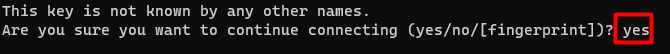
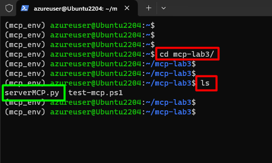

#  Desplegar MCP de referencia local, cargar dataset de ejemplo y ejecutar consultas seguras (incluye habilitar auth simple)

## Objetivo de la práctica:
Al finalizar la práctica, serás capaz de:
- Desplegar un servidor MCP de referencia local, integrando un modelo de lenguaje desde Azure AI Foundry y configurando el entorno de ejecución en Ubuntu.
- Implementar políticas de seguridad y autenticación, incluyendo la generación y uso de certificados digitales y una autoridad certificadora local.
- Ejecutar consultas seguras sobre el dataset cargado, utilizando Postman y verificando la comunicación cifrada mediante mTLS y roles definidos.


## Diagrama del laboratorio 
El siguiente diagrama resume visualmente lo que realizarás a lo largo de la siguiente práctica. 


## Duración aproximada:
- 60 minutos.

## Instrucciones 
Los servidores MCP (Managed Control Plane) constituyen una arquitectura moderna para la gestión centralizada de servicios de inteligencia artificial, redes y seguridad en entornos distribuidos. Su base se fundamenta en la separación entre el plano de control y el plano de datos, permitiendo que las decisiones de configuración, autenticación y autorización se tomen de forma independiente al procesamiento de la información. Esto facilita la escalabilidad, la observabilidad y el cumplimiento de políticas de seguridad en sistemas complejos. Los servidores MCP suelen integrarse con herramientas de orquestación, proxies inversos y servicios de identidad, y son clave en entornos donde se requiere gobernanza estricta sobre modelos de IA, APIs y microservicios.

En el siguiente laboratorio realizarás la implementación de un servidor MCP sobre una máquina Ubuntu. Conectarás un modelo de lenguaje GPT-4o previamente desplegado en Azure AI Foundry, y establecerás una política de seguridad que regule el acceso al modelo. Además, generarás certificados digitales y configurarás una Autoridad Certificadora (CA) local para firmarlos. Esta infraestructura se integrará con un proxy nginx que actuará como intermediario seguro entre los clientes y el servidor MCP. Finalmente, probarás la conexión segura utilizando Postman, verificando que las políticas y certificados funcionen correctamente en un entorno cifrado.

### Tarea 1. Acceder al entorno del laboratorio.

**Paso 1.** Desde tu equipo accede al servicio de Escritorio remoto. La dirección IP y las credenciales será proporcionadas por tu insturctor. 


---

**Paso 2.** Una vez en tu máquina virtual, haz clic en el botón de **Inicio** y busca `Powershell`. Al seleccionarlo, elige la opción **Run as administrator**.


---

**Paso 3.** En la ventana de PowerShell, ejecuta el siguiente comando para iniciar una sesión SSH en la máquina Ubuntu del laboratorio. La dirección IP y las credenciales serán proporcionadas por tu instructor.

```bash 
ssh usuario@direccion_ip
```


---

**Paso 4.** Acepta la advertencia de seguridad escribiendo `yes` y presionando Enter.



---

**Paso 5.** Ingresa la contraseña proporcionada por tu instructor y presiona Enter para iniciar sesión.


---

**Paso 6.** Ahora estás en el servior de Linux. En este, vamos a trabajar en un entorno aislado para hacer nuestras pruebas, para ellos lanzaras los siguientes comando para ingresar al entorno:

```bash
python3 -m venv mcp_env
source mcp_env/bin/activate
```

Asegurate que al inicio de la siguiente línea esté el nombre del entorno entre paréntesis. 


---

**Paso 7.** Finalmente, accede a la ubicación del directorio del laboratorio con el siguiente comando:

```bash 
cd mcp-lab3
```

Luego ejecuta el comando `ls` y valida que esté el archivo **serverMCP.py**.



### Tarea 2. Crear un deployment en Azure AI Foundry

**Paso 1.** Accede al portal de Azure AI Foundry desde tu navegador: [https://ai.azure.com/](https://ai.azure.com/). Luego, inicia sesión con las credenciales otorgadas por tu instructor. 


---

**Paso 2.** Desplazate hacia el costado inferior, y en la sección ***Explore models and capabilities*** busca `gpt-4o` y haz clic sobre él. 


---

**Paso 3.** Haz clic en el botón **Use this model** para iniciar el proceso de despliegue del modelo.


---

**Paso 4.** Se abrirá una ventana emergente, donde te solicitará crear un proyecto antes del deployment, haz clic en **Create** y espera que se termine de crear el proyecto, esto puede tardar unos segundos, incluso minutos.


---

**Paso 5.** Una vez creado el proyecto, automáticamente aparecerá la ventana de creación del Deployment, deja lo valores por defecto y haz clic en **Deploy**.


---

**Paso 6.** Espera a que el deployment se complete, esto puede tardar algunos segundos. Una vez finalizado, ya tendrás acceso al modelo GPT-4o.


---

**Paso 7.** Dentro de la máquina virtual de Windows abre un bloc de notas, haciendo clic en el botón **Inicio** y buscando `Notepad`. Abre un bloc de notas. 


---

**Paso 8.** Regresa al portal de Azure AI Foundry y copia el valor del campo **Endpoint URI** del deployment que acabas de crear, pégalo en el bloc de notas. Luego, haz lo mismo con la llave, copiando el valor del campo **Key** y pégalo también en el bloc de notas.


---

**Paso 9.** Regresa a la ventana de PowerShell y vas a enviar los siguientes comandos, reemplazando tanto la **URL** como la **KEY** por los valores que pegaste en el bloc de notas, respectivamente. 

```bash
export AZURE_OPENAI_ENDPOINT="URL"
```


```bash
export AZURE_OPENAI_KEY="KEY"
```


### Tarea 3. Levantar el servidor MCP y validar conexión

**Paso 1.** En la misma ventana de PowerShell, ejecuta el siguiente comando para lanzar el servidor MCP previamente creado.

```bash
python3 serverMCP.py
```

**IMPORTANTE:** No cierres la ventana ni envíes ningún comando, dado que se está ejecutando un servidor Flask en modo desarrollo desde el script serverMCP.py. Este servidor es accesible por el puerto 8080. Flask es un microframework de Python para crear aplicaciones web de forma sencilla y flexible.


---

**Paso 2.** Deja la ventana de Powershell anterior en ese estado de ejecución, y abre **Postman**. En el escritorio de tu máquina virtual de Windows encontrarás el ícono naranja de un hombre cohete. Una vez abierta, cierra la ventana emergente que te invita a iniciar sesión.


---

Postman es una herramienta de desarrollo que se utiliza para **diseñar, probar y documentar APIs**, permitiendo enviar solicitudes HTTP, visualizar respuestas y automatizar flujos de trabajo en entornos de desarrollo y pruebas.

**Paso 3.** En Postman, selecciona el método **POST** en la ventana de solicitud y luego agrega la siguiente URI. Reemplaza el valor **IP** por la dirección IP con la que accediste al servidor de Ubuntu en el **paso 3 de la Tarea 1**.

`http://`**IP**`:8080/ask?Content-Type=application/json`


En la pestaña **Params** de Postman automáticamente debería agregarse el parámetro ***Content-Type=application/json***.

---

**Paso 4.** Selecciona la pestaña **Body**, luego selecciona la opción **raw** y escribe el prompt con la temperatura:

```json
{
    "prompt": "En una frase define la seguridad con IA",
    "temperature": 0.2
}
```

Luego haz clic en el botón **Send**.


---

**Paso 5.** Si todo está correcto, deberías recibir una respuesta del modelo GPT-4o con la definición solicitada. Tómate un momento para validar la respuesta y las opciones otorgadas, incluyendo las barreras de seguridad de filtro de de contenido.


---

**Paso 6.** Regresa a la ventana de PowerShell y verifica que haya una nueva línea con el estatus correcto y el **código 200**.


### Tarea 4. Agregar seguridad y tus propios datos

**Paso 1.** Detén la ejecución del servidor MCP en la ventana de PowerShell presionando las teclas `Ctrl + C`. Luego, ejecuta el siguiente comando para crear tres directorios: **data, certs** y **conf**.

```bash
mkdir data certs conf
```


---

**Paso 2.** A continuación, vas a instalar o verificar la instalación de las dependencias con el siguiente comando:

```bash
pip install flask requests pyyaml
```

Estas bibliotecas las usaremos para lo siguiente:

- **Flask:** un microframework para crear aplicaciones web y APIs RESTful de forma rápida y sencilla.
- **Requests:** una biblioteca que permite realizar peticiones HTTP (GET, POST, PUT, DELETE, etc.) de manera intuitiva, ideal para consumir APIs externas.
- **PyYAML:** una herramienta para leer y escribir archivos YAML, muy útil para manejar configuraciones en formato legible por humanos


---

**Paso 3.** Ahora, en el directorio conf que creaste previamente, vas a crear un archivo YAML de configuración de roles y permisos para el servidor MCP, que define qué endpoints puede acceder cada rol y cómo se asignan mediante certificados o tokens.

Para esto ejecuta el siguiente comando:

```bash
nano conf/policy.yaml
```


---

**Paso 4.** Luego, copia y pega la siguiente configuración en el archivo abierto:

```yaml
version: "1.0"
roles:
  - name: llm_viewer
    allowed_endpoints:
      - path: /context
        methods: [GET]
      - path: /docs
        methods: [GET]
  - name: data_manager
    allowed_endpoints:
      - path: /docs
        methods: [GET, POST]
mapping:
  cert_cn_to_role:
    "llm-agent-1": "llm_viewer"
    "data-manager-1": "data_manager"
  token_to_role:
    "demo-token-llm": "llm_viewer"
    "demo-token-manager": "data_manager"
```

Luego, guarda los cambios presionando `Ctrl + O`, confirma con **Enter** y cierra el editor con `Ctrl + X`.


---

**Paso 5.** A continuación, vas a generar y firmar certificados digitales con **OpenSSL** para establecer una infraestructura de autenticación entre cliente y servidor usando una autoridad certificadora (CA) propia.

Estos certificados los almacenaremos en el directorio **certs** que creaste previamente, es por esto que debes cambiar de directorio con el siguiente comando:

```bash
cd certs
```

Luego, procederás a enviar los siguientes comandos uno a uno:

**CA**
```bash
openssl genrsa -out ca.key 4096
```

```bash
openssl req -x509 -new -nodes -key ca.key -sha256 -days 3650 -out ca.crt -subj "/C=CO/ST=Antioquia/L=Medellin/O=Lab/OU=CA/CN=Lab-Root-CA"
```


**Server cert (NGINX)**
```bash
openssl genrsa -out server.key 2048
```
```bash
openssl req -new -key server.key -out server.csr -subj "/CN=mcp.local"
```
>**IMPORTANTE:** En el siguiente comando debe reemplazarse el valor ***IP_VM*** por la dirección IP con la que accediste al servidor de Ubuntu en el **paso 3 de la Tarea 1**
```bash
openssl x509 -req -in server.csr -CA ca.crt -CAkey ca.key -CAcreateserial -out server.crt -days 825 -sha256 -extfile <(printf "subjectAltName=DNS:mcp.local,IP:<IP_VM>")
```

**Client cert**
```bash
openssl genrsa -out client.key 2048
```
```bash
openssl req -new -key client.key -out client.csr -subj "/CN=llm-agent-1"
```
```bash
openssl x509 -req -in client.csr -CA ca.crt -CAkey ca.key -CAcreateserial -out client.crt -days 825 -sha256
```


**NOTA:** En un entorno real, los certificados se almacenan en ubicaciones seguras según su función: los del servidor en rutas protegidas del sistema, los del cliente en sus dispositivos o aplicaciones, y los de la autoridad certificadora en servidores con acceso restringido. Además, se usan gestores de secretos como Vault o Azure Key Vault para protegerlos y controlar su acceso.

---

**Paso 6.** Una vez generados los certificados, verifica que se hayan generado los siguientes archivos con el comando `ls`:


---

**Paso 7.** Ahora, vamos a instalar nginx con el siguiente comando:

```bash
sudo apt install -y nginx
```


Nginx se usará como proxy inverso para habilitar comunicación segura con mTLS entre el cliente y el servidor MCP.

---

**Paso 8.** Una vez instalado nginx, vamos a crear el archivo de configuración, para esto ejecutarás el siguiente comando:

```bash
sudo nano /etc/nginx/sites-available/mcp.conf
```


---

**Paso 9.** Copia y pega la siguiente configuración en el archivo abierto:

```nginx
server {
    listen 443 ssl;
    server_name _;

    ssl_certificate     /home/azureuser/mcp-lab3/certs/server.crt;
    ssl_certificate_key /home/azureuser/mcp-lab3/certs/server.key;

    ssl_client_certificate /home/azureuser/mcp-lab3/certs/ca.crt;
    ssl_verify_client on;

    location / {
        proxy_pass http://127.0.0.1:8080;
        proxy_set_header X-SSL-CLIENT-CN $ssl_client_s_dn;
    }
}
```
Luego, guarda los cambios presionando `Ctrl + O`, confirma con **Enter** y cierra el editor con `Ctrl + X`.


---

**Paso 10.** Ahora, crea un enlace simbólico para habilitar el sitio en nginx con el siguiente comando:

```bash
sudo ln -s /etc/nginx/sites-available/mcp.conf /etc/nginx/sites-enabled/
```


---

**Paso 11.** Verifica que la configuración de nginx no tenga errores con el siguiente comando:

```bash
sudo nginx -t
```


---

**Paso 12.** Si no hay errores, reinicia nginx para aplicar los cambios con el siguiente comando:

```bash
sudo systemctl restart nginx
```


---

**Paso 13.** Ahora, regresa al directorio anterior ejecutando el comando `cd ..`. Verifica que estés en el directori principal del laboratorio con `pwd`, debería aparecerte **/home/usuario/mcp-lab3**. 

Allí vamos a crear un nuevo servidor MCP llamado **SecureServer.py**, para esto ejecuta el siguiente comando:

```bash
nano SecureServer.py
```


---

**Paso 14.** Copia y pega el siguiente código en el archivo abierto:

```python
# server.py
import os, json, uuid, yaml, time
from flask import Flask, request, jsonify, abort
import requests

app = Flask(__name__)
DATA_PATH = "./data/transactions.json"
POLICY_FILE = "./conf/policy.yaml"

# load policy
with open(POLICY_FILE) as f:
    policy = yaml.safe_load(f)

def map_cn_to_role(cn):
    cn = (cn or "").strip()
    # NGINX entrega DN como e.g. "CN=llm-agent-1,...", extraer CN
    if "CN=" in cn:
        parts = [p for p in cn.split(",") if p.strip().startswith("CN=")]
        if parts:
            cn = parts[0].split("=",1)[1]
    return policy["mapping"]["cert_cn_to_role"].get(cn)

def map_token_to_role(token):
    return policy["mapping"]["token_to_role"].get(token)

def audit_log(entry):
    # simple stdout audit
    print(json.dumps(entry, ensure_ascii=False))

def require_auth(path, method):
    # Check mTLS header set by NGINX
    raw_cn = request.headers.get("X-SSL-CLIENT-CN","")
    role = map_cn_to_role(raw_cn)
    if role:
        allowed = [e for e in policy["roles"] if e["name"]==role][0]["allowed_endpoints"]
        for a in allowed:
            if a["path"]==path and method in a["methods"]:
                return role, "cert"
    # Fallback: Bearer token
    auth = request.headers.get("Authorization","")
    if auth.lower().startswith("bearer "):
        token = auth.split(None,1)[1].strip()
        role = map_token_to_role(token)
        if role:
            allowed = [e for e in policy["roles"] if e["name"]==role][0]["allowed_endpoints"]
            for a in allowed:
                if a["path"]==path and method in a["methods"]:
                    return role, "token"
    return None, None

# Load dataset into memory (simple)
def load_dataset():
    with open(DATA_PATH) as f:
        return json.load(f)

DATA = load_dataset()

@app.route("/context", methods=["GET"])
def context_handler():
    request_id = str(uuid.uuid4())
    role, auth_type = require_auth("/context","GET")
    audit_log({"request_id":request_id,"endpoint":"/context","auth_role":role,"auth_type":auth_type,"ts":time.time()})
    if not role:
        return jsonify({"error":"No autorizado"}), 403
    # simple context
    return jsonify({
        "id":"ctx-demo",
        "type":"session",
        "content":{"user":"analyst_banca01","role":role,"task":"evaluar transacciones"},
        "timestamp": time.strftime("%Y-%m-%dT%H:%M:%SZ", time.gmtime())
    })

@app.route("/docs/query", methods=["GET"])
def docs_query():
    request_id = str(uuid.uuid4())
    role, auth_type = require_auth("/docs","GET")
    audit_log({"request_id":request_id,"endpoint":"/docs/query","auth_role":role,"auth_type":auth_type,"params":dict(request.args),"ts":time.time()})
    if not role:
        return jsonify({"error":"No autorizado"}), 403
    q = request.args.get("q","").lower()
    results = [d for d in DATA if q in (d.get("summary","")+" "+d.get("doc_id","")).lower()] if q else DATA
    return jsonify({"request_id":request_id,"count":len(results),"results":results})

@app.route("/docs/load", methods=["POST"])
def docs_load():
    # require manager role
    request_id = str(uuid.uuid4())
    role, auth_type = require_auth("/docs","POST")
    audit_log({"request_id":request_id,"endpoint":"/docs/load","auth_role":role,"auth_type":auth_type,"ts":time.time()})
    if not role:
        return jsonify({"error":"No autorizado"}), 403
    body = request.get_json(force=True)
    # replace DATA file (demo)
    with open(DATA_PATH,"w") as f:
        json.dump(body, f, ensure_ascii=False, indent=2)
    return jsonify({"status":"ok","loaded":len(body)})

@app.route("/ask", methods=["POST"])
def ask_handler():
    request_id = str(uuid.uuid4())
    role, auth_type = require_auth("/context","GET")  # require at least context read role
    audit_log({"request_id":request_id,"endpoint":"/ask","auth_role":role,"auth_type":auth_type,"ts":time.time()})
    if not role:
        return jsonify({"error":"No autorizado"}), 403

    payload = request.get_json(force=True)
    prompt = payload.get("prompt","")
    if not prompt:
        return jsonify({"error":"Se requiere prompt"}), 400

    # Get context
    context = {"user":"analyst_banca01","role":role,"task":"evaluar transacciones"}

    messages = [
      {"role":"system","content":"Contexto: "+json.dumps(context)},
      {"role":"user","content":prompt}
    ]

    endpoint = os.getenv("AZURE_OPENAI_ENDPOINT")
    key = os.getenv("AZURE_OPENAI_KEY")
    if not endpoint or not key:
        return jsonify({"error":"Azure OpenAI no configurado"}), 500

    headers = {"api-key": key.strip(), "Content-Type":"application/json"}
    body = {"messages": messages, "temperature": payload.get("temperature",0.2)}

    try:
        r = requests.post(endpoint, headers=headers, json=body, timeout=30)
        rj = r.json()
    except Exception as e:
        return jsonify({"error":"Error al llamar a Azure OpenAI","details":str(e)}), 502

    # extract text if present
    extracted = None
    try:
        choices = rj.get("choices", [])
        if choices:
            msg = choices[0].get("message") or choices[0]
            if isinstance(msg, dict):
                extracted = msg.get("content")
            else:
                extracted = choices[0].get("text")
    except:
        extracted = None

    return jsonify({"request_id":request_id,"azure_status":r.status_code,"azure_response":rj,"extracted_text":extracted}), r.status_code

if __name__ == "__main__":
    app.run(host="127.0.0.1", port=8080)
```

Luego, guarda los cambios presionando `Ctrl + O`, confirma con **Enter** y cierra el editor con `Ctrl + X`.


---

**Paso 15.** Ahora, crea un archivo JSON con datos de ejemplo. Ejecuta el siguiente comando:

```bash
nano data/transactions.json
```


---

**Paso 16.** Copia y pega el siguiente contenido en el archivo abierto:

```json
[
  {"doc_id":"trans-001","account":"881","amount":9500,"currency":"COP","date":"2025-09-01","risk":"alto","summary":"Transferencia inusual"},
  {"doc_id":"trans-002","account":"312","amount":4200,"currency":"COP","date":"2025-09-02","risk":"medio","summary":"Pago recurrente"}
]

```

Luego, guarda los cambios presionando `Ctrl + O`, confirma con **Enter** y cierra el editor con `Ctrl + X`.


---

**Paso 17.** Finalmente, lanza el servidor seguro con el siguiente comando:

```bash
python3 SecureServer.py
```


### Tarea 5. Configurar Postman para enviar la prueba con los certificados

**Paso 18.** Deja la ventana de Powershell anterior en ese estado de ejecución, y abre una nueva ventana de Powershell. En esta nueva ventana vas a descargar los certificados a tu máquina virtual de Windows para realizar la prueba de conexión. 

Para esto, ejecuta los siguientes comandos, y usa la contraseña de la máquina de Ubuntu que utilizaste en **el paso 5 de la tarea 1** en cada ejecución.

Debes reemplazar **usuario** y **direccion_ip** por las credeciales que usaste en **el paso 3 de la tarea 1**.

```bash
scp usuario@direccion_ip:/home/usuario/mcp-lab3/certs/ca.crt .
```

```bash
scp usuario@direccion_ip:/home/usuario/mcp-lab3/certs/client.key .
```

```bash
scp usuario@direccion_ip:/home/usuario/mcp-lab3/certs/client.crt .
```


---

**Paso 19.** Abre nuevamente Postman y accede al botón del engrane del costado superior derecho, y luego elige la opción **Settings**.


---

**Paso 20.** En la ventana emergente, selecciona la pestaña **Certificates** y haz clic en el botón **Add Certificate**.


---

**Paso 21.** En el campo **Host** ingresa la dirección IP con la que accediste al servidor de Ubuntu en el **paso 3 de la Tarea 1**. En el campo **CRT file** selecciona el archivo **client** que descargaste previamente, y en el campo **KEY file** selecciona el archivo **client.key**. Finalmente, haz clic en el botón **Add**.


---

**Paso 23.** En la ventana emergente ya verás los certificados cargados. Ahora activa el Check de la opción **CA Certificates**, para que quede en estado **ON**, y selecciona el archivo **ca** que descargaste previamente. 


Luego cierra la ventana emergente.

---

**Paso 22.** Ahora, regresa a la ventana principal de Postman y selecciona el método **POST** en la ventana de solicitud y luego agrega la siguiente URI. Reemplaza el valor **IP** por la dirección IP con la que accediste al servidor de Ubuntu en el **paso 3 de la Tarea 1**.

`https://`**IP**`/ask`

En la pestaña **Body**, asegurate de mantener la opción **raw** seleccionada, y agrega lo siguiente:

```json
{
    "prompt": "Dame un resumen  de las transacciones sospechosas",
    "temperature": 0.3
}
```


**NOTA:** Ahora la URI inicia con **https** dado que estamos usando un canal seguro con TLS.

---

**Paso 24.** Selecciona la pestaña **Headers** y agrega los siguientes valores:

| Key            | Value               |
|----------------|---------------------|
| Content-Type   | application/json    |


---

**Paso 23.** Finalmente, haz clic en el botón **Send** para enviar la solicitud.

### Resultados finales

Si todo está correcto, deberías recibir una respuesta del modelo GPT-4o con el resumen solicitado. Tómate un momento para validar la respuesta y las opciones otorgadas, incluyendo las barreras de seguridad de filtro de contenido. Verifica también el ícono del candado. 


---

Regresa a la ventana de PowerShell donde se está ejecutando el servidor seguro y verifica que haya una nueva línea con el estatus correcto y el **código 200** y toda la información de los certificados.


