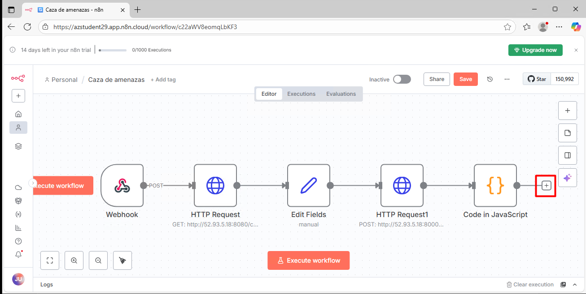
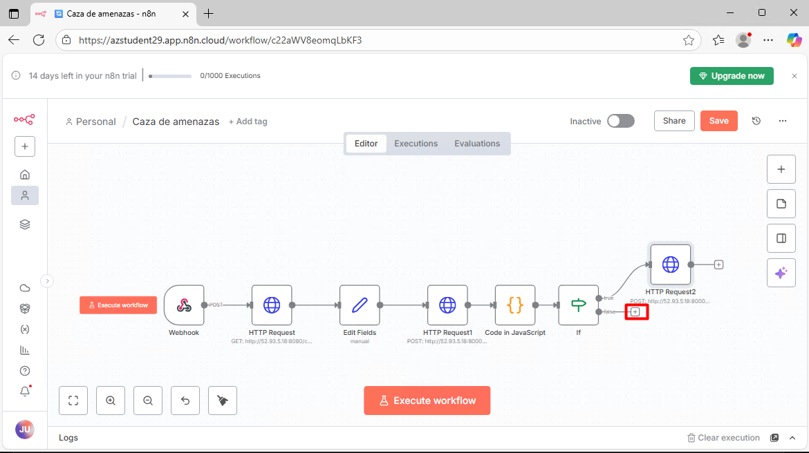

#  Crear workflow de caza de amenazas en n8n

## Objetivo de la práctica:

Al finalizar la práctica, serás capaz de:

- Configurar un flujo de caza de amenazas en n8n que incluya un Webhook de entrada, nodos HTTP Request, Set y Code para recopilar y enriquecer eventos desde el servidor Ubuntu.

- Normalizar y evaluar riesgos usando lógica personalizada (nodo Code) y reglas condicionales (nodo IF) para asignar puntajes y clasificar niveles de riesgo.

- Orquestar acciones automáticas y realizar pruebas: enviar bloqueos al servicio de mitigación (/context/block), registrar eventos (/logs) y validar el flujo con Postman.

## Diagrama del laboratorio 
El siguiente diagrama resume visualmente lo que realizarás a lo largo de la siguiente práctica. 


## Duración aproximada:
- 60 minutos.

## Instrucciones 
n8n es una plataforma de automatización de flujos de trabajo de código abierto que permite conectar aplicaciones, servicios y procesos mediante una interfaz visual. Su diseño flexible y modular facilita la creación de integraciones personalizadas, combinando lógica de negocio con múltiples fuentes de datos sin necesidad de programación avanzada.

En el siguiente laboratorio realizarás la creación de un flujo automatizado en n8n para analizar indicadores de riesgo y tomar decisiones de mitigación. Configurarás un endpoint simulado en Ubuntu y construirás un flujo con nodos que incluyen un webhook de entrada, consultas HTTP, procesamiento de datos, análisis con LLM, evaluación de gravedad y acciones según el nivel de riesgo.


### Tarea 1. Acceder al entorno del laboratorio.

**Paso 1.** Desde tu equipo accede al servicio de Escritorio remoto. La dirección IP y las credenciales será proporcionadas por tu insturctor. 


---

**Paso 2.** Una vez en tu máquina virtual, haz clic en el botón de **Inicio** y busca `Powershell`. Al seleccionarlo, elige la opción **Run as administrator**.


---

**Paso 3.** En la ventana de PowerShell, ejecuta el siguiente comando para iniciar una sesión SSH en la máquina Ubuntu del laboratorio. La dirección IP y las credenciales serán proporcionadas por tu instructor.

```bash 
ssh usuario@direccion_ip
```


---

**Paso 4.** Acepta la advertencia de seguridad escribiendo `yes` y presionando Enter.


---

**Paso 5.** Ingresa la contraseña proporcionada por tu instructor y presiona Enter para iniciar sesión.


---

**Paso 6.** Ahora estás en el servior de Linux. En este, vamos a trabajar en un entorno aislado para hacer nuestras pruebas, para ellos lanzaras los siguientes comando para ingresar al entorno:

```bash
mkdir -p n8n-lab
```

```bash
cd n8n-lab
```

```bash
python3 -m venv n8n_lab
source n8n_lab/bin/activate
```

Asegurate que al inicio de la siguiente línea esté el nombre del entorno entre paréntesis. En el caso de este laboratorio **venv**.


---

**Paso 7.** Finalmente, vamos a validar las dependencias parala elaboración del laboratorio.

```bash 
python -m pip install flask
```


### Tarea 2. Ingresar a n8n y crear una nueva cuenta

**Paso 1.** Abre un navegador web en la máquina virtual.


---

**Paso 2.** En la barra de direcciones, ingresa la siguiente URL para acceder a n8n: `https://app.n8n.cloud`. Haz clic en el botón **Start a free trial** para crear una nueva cuenta.


---

**Paso 3.** Responde las preguntas que te plantean con la siguiente información en cada una de las ventanas. 

- ¿Quién usará esta cuenta? `Only me`
- ¿A qué área perteneces? `Other` -> `Security` -> OK
- ¿A qué se dedica tu empresa? `Ecommerce`
- ¿Para qué usarás n8n? `Setting up a webhook` -> OK
- ¿Cómo te enteraste de n8n? `Friend / Word of mouth` -> Submit

---

**Paso 4.** Diligencia el formulario final con tus datos, y haz clic en el botón **Start free 14-day trial**.

- Full Name: ***Tu nombre***
- Company email: ***El correo usado para el laboratorio 1 y 2***
- Password: ***La misma contraseña usada para el laboratorio 1 y 2***
- Account Name: ***El mismo correo usado anteriormente, pero sin el dominio (omite todo lo que está después del @)***


---

**Paso 5.** Omite las siguientes dos ventanas haciendo clic en **Skip**.


---

**Paso 6.** Finalmente, haz clic en el botón **Start automating** para ingresar a la plataforma.


---

**Paso 7.** Revisa la URL, observa como inicia con el nombre de la cuenta que seleccionaste anteriormente. 


### Tarea 3. Crear el workflow de caza de amenazas

**Paso 1.** Haz clic en el botón **+**, luego en **Workflow** y finalmente en **Personal** para crear un nuevo flujo de trabajo.


---

**Paso 2.** Cambia el nombre del flujo de trabajo haciendo clic en **My Workflow** ubicado en la parte superior izquierda. Nómbralo como `Caza de amenazas` y verifica que se haya guardado.


---

**Paso 3.** En el centro de la pantalla haz clic en **+ Add first step**, busca el nodo **Webhook** en la barra de búsqueda que aparece y selecciona el que tiene un ícono de un "rayo naranja" a su derecha. 


---

**Paso 4.** Configura el nodo Webhook de la siguiente manera:

- **HTTP Method**: `POST`.
- **Path**: `threat-detection`.

Luego, haz clic en el botón **<- Back to canvas** ubicado en el costado superior izquierdo. 


---

**Paso 5.** Haz clic en el botón **+** que aparece al costado derecho del nodo Webhook para agregar un nuevo nodo. Busca el nodo **HTTP Request** y selecciónalo.


---

**Paso 6.** Configura el nodo HTTP Request de la siguiente manera:
Asegurate de cambiar la ***IP-SERVIDOR-UBUNTU*** por la dirección que usas para conectarte al servidor Ubuntu por PowerShell.

- **HTTP Method**: `GET`.
- **URL**: `http://<IP-SERVIDOR-UBUNTU>:8080/context?source=alerts`
- **Send Headers**: Activado.

Luego, usando la barra de desplazamiento, dirigete a la parte inferior de la misma ventana


---

**Paso 7.** En la sección **Headers parameters**, agrega la siguiente información:

| Name           | Value               |
|----------------|---------------------|
| `Accept` | `application/json` |

Luego, haz clic en el botón **<- Back to canvas** ubicado en el costado superior izquierdo.


---

**Paso 8.** Haz clic en el botón **+** que aparece al costado derecho del nodo HTTP Request para agregar un nuevo nodo. Busca el nodo **Set** y selecciona **Edit Fields (Set)**.


---

**Paso 9.** Haz clic en la opción **Add Field** que aparece en el centro de la ventana y configura el campo de la siguiente manera:

- `ip`
- **String**
- `{{$json["ip"]}}`


---

**Paso 10.** Haz clic en la opción **Add Field** que aparece en el costado inferior, y configura el nuevo campo de la siguiente manera: 

- `threat_type`
- **String**
- `{{$json["threat_type"]}}`

Luego, haz clic en el botón **<- Back to canvas** ubicado en el costado superior izquierdo.


---

**Paso 11.** Haz clic en el botón **+** que aparece al costado derecho del nodo Set para agregar un nuevo nodo. Busca el nodo **HTTP Request** y selecciónalo.


---

**Paso 12.** Configura el nodo HTTP Request de la siguiente manera:

Asegurate de cambiar la ***IP-SERVIDOR-UBUNTU*** por la dirección que usas para conectarte al servidor Ubuntu por PowerShell.

- **HTTP Method**: `POST`.
- **URL**: `http://<IP-SERVIDOR-UBUNTU>:8000/context/block`
- **Send Headers**: Activado.

- En la sección **Headers parameters**, agrega la siguiente información:

| Name           | Value               |
|----------------|---------------------|
| `Accept` | `application/json` |


---

**Paso 13.** Usando la barra de desplazamiento, dirigete a la sección **Body Parameters** y agrega la siguiente información:

- **Send Body:** Activado.
- **Specify Body:** `Using JSON`.
- **JSON:**

```json
{
  "source": "192.168.1.100",
  "reason": "Risk detected"
}

```

Luego, haz clic en el botón **<- Back to canvas** ubicado en el costado superior izquierdo.


---

**Paso 14.** Haz clic en el botón **+** que aparece al costado derecho del nodo HTTP Request para agregar un nuevo nodo. Busca el nodo **Code** y selecciónalo.


---

**Paso 15.** Selecciona la opción **Code in JavaScript**


---

**Paso 15.** Agrega el siguiente Script en la sección **JavaScript**:

```javascript
const orig = items[0].json.original_event || {};
const llm = items[0].json || {};
let classification = llm.classification || (llm.choices?.[0]?.message?.content || "");
classification = classification.toString().toLowerCase();

let score = 0;
if (classification.includes("alto") || classification.includes("high")) score = 85;
else if (classification.includes("medio") || classification.includes("medium")) score = 55;
else score = 15;

return [{
  json: {
    alert_id: orig.alert_id || "no-id",
    ip: orig.ip,
    uri: orig.uri,
    user_agent: orig.user_agent,
    llm_classification: classification,
    risk_score: score,
    llm_raw: llm
  }
}];
```

Esta función de JavaScript toma los datos del evento y la clasificación generada por un modelo LLM (como resultado de un análisis de riesgo), normaliza esa clasificación a minúsculas y le asigna un puntaje de riesgo: 85 si es "alto/high", 55 si es "medio/medium" y 15 en cualquier otro caso. Luego, construye y retorna un objeto JSON que incluye el ID de alerta, IP, URI, agente de usuario, la clasificación del LLM, el puntaje de riesgo calculado y los datos completos del análisis LLM.

Luego, haz clic en el botón **<- Back to canvas** ubicado en el costado superior izquierdo.


---

**Paso 16.** Haz clic en el botón **+** que aparece al costado derecho del nodo Code para agregar un nuevo nodo. Busca el nodo **IF** y selecciónalo.




---

**Paso 17.** Configura el nodo IF de la siguiente manera:

- **fx:** `{{$json["risk_score"]}} >= 70`
- **Number:** `is grather than`
- **Value:** `70`

Luego, haz clic en el botón **<- Back to canvas** ubicado en el costado superior izquierdo.


---

**Paso 18.** Haz clic en el botón **+** que aparece al costado derecho del nodo IF, en la sección **true**, para agregar un nuevo nodo. Busca el nodo **HTTP Request** y selecciónalo.


---

**Paso 19.** Configura el nodo HTTP Request de la siguiente manera:

Asegurate de cambiar la ***IP-SERVIDOR-UBUNTU*** por la dirección que usas para conectarte al servidor Ubuntu por PowerShell.

- **HTTP Method**: `POST`.
- **URL**: `http://<IP-SERVIDOR-UBUNTU>:8000/context/block`
- **Send Headers**: Activado.
- En la sección **Headers parameters**, agrega la siguiente información:

| Name           | Value               |
|----------------|---------------------|
| `Accept` | `application/json` |


---

**Paso 20.** Usando la barra de desplazamiento, dirigete a la sección **Body Parameters** y agrega la siguiente información:

- **Send Body:** Activado.
- **Specify Body:** `Using JSON`.
- **JSON:**

```json
{
  "source": "alerts",
  "action": "block",
  "reason": "High risk detected by n8n workflow"
}
```

Luego, haz clic en el botón **<- Back to canvas** ubicado en el costado superior izquierdo.


---

**Paso 21.** Haz clic en el botón **+** que aparece al costado derecho del nodo IF, en la sección **false**, para agregar un nuevo nodo. Busca el nodo **HTTP Request** y selecciónalo.




---

**Paso 22.** Configura el nodo HTTP Request de la siguiente manera:

Asegurate de cambiar la ***IP-SERVIDOR-UBUNTU*** por la dirección que usas para conectarte al servidor Ubuntu por PowerShell.

- **HTTP Method**: `POST`.
- **URL**: `http://<IP-SERVIDOR-UBUNTU>:8080/logs`
- **Send Headers**: Activado.
- En la sección **Headers parameters**, agrega la siguiente información:

| Name           | Value               |
|----------------|---------------------|
| `Accept` | `application/json` |


---

**Paso 23.** Usando la barra de desplazamiento, dirigete a la sección **Body Parameters** y agrega la siguiente información:

- **Send Body:** Activado.
- **Specify Body:** `Using JSON`.
- **JSON:**

```json
{
  "source": "alerts",
  "risk_score": "={{$json['risk_score']}}",
  "status": "logged",
  "message": "Event registered as medium or low risk by n8n"
}
```

Luego, haz clic en el botón **<- Back to canvas** ubicado en el costado superior izquierdo.


---

**Paso 24.** Finalmente, guarda el flujo de trabajo haciendo clic en el ícono **Save** ubicado en la parte superior derecha de la pantalla.


### Tarea 4. Crear el servicio de mitigación en el servidor Ubuntu

**Paso 1.** Regresa a la ventana de PowerShell donde iniciaste sesión en el servidor Ubuntu, y ejecuta el siguiente comando para crear un servicio de mitigación:

```bash
nano mitigate_service.py
```


---

**Paso 2.** Copia y pega el siguiente código en el archivo `mitigate_service.py`:

```python
from flask import Flask, request, jsonify
import datetime
import logging

app = Flask(__name__)

# Configurar logs
logging.basicConfig(
    filename="mitigation.log",
    level=logging.INFO,
    format="%(asctime)s - %(levelname)s - %(message)s"
)

# --- Simulación de base de datos o lista de orígenes bloqueados ---
blocked_sources = []

@app.route("/context/block", methods=["POST"])
def block_source():
    """
    Endpoint expuesto por el LLM Gateway simulado (puerto 8000)
    Recibe solicitudes de bloqueo generadas desde n8n cuando se detecta alto riesgo.
    """
    data = request.get_json(force=True)
    source = data.get("source", "unknown")
    reason = data.get("reason", "unspecified")

    # Registrar acción
    blocked_entry = {
        "source": source,
        "reason": reason,
        "timestamp": datetime.datetime.now().isoformat()
    }
    blocked_sources.append(blocked_entry)

    logging.info(f"Blocked source: {source} - Reason: {reason}")
    print(f"✅ Source '{source}' blocked due to: {reason}")

    return jsonify({
        "status": "success",
        "action": "block",
        "source": source,
        "reason": reason,
        "blocked_at": blocked_entry["timestamp"]
    }), 200


@app.route("/context", methods=["GET"])
def get_context():
    """
    Endpoint del MCP Server (puerto 8080)
    Devuelve contexto general de alertas o eventos de riesgo.
    """
    source = request.args.get("source", "alerts")
    context = {
        "source": source,
        "active_blocks": len(blocked_sources),
        "recent_blocks": blocked_sources[-5:],  # Últimos 5 bloqueos
        "system_status": "operational"
    }
    return jsonify(context), 200


@app.route("/logs", methods=["POST"])
def log_event():
    """
    Endpoint de registro para eventos de riesgo medio/bajo.
    """
    data = request.get_json(force=True)
    source = data.get("source", "alerts")
    score = data.get("risk_score", "N/A")
    message = data.get("message", "No message provided")

    logging.info(f"Logged event - Source: {source}, Score: {score}, Message: {message}")
    print(f"ℹ️ Logged event from {source}: Risk={score}, Msg={message}")

    return jsonify({
        "status": "logged",
        "source": source,
        "risk_score": score,
        "message": message,
        "logged_at": datetime.datetime.now().isoformat()
    }), 201


if __name__ == "__main__":
    # Ejecutar como dos servicios distintos simulados:
    # MCP (8080) y Gateway (8000)
    import threading

    def run_gateway():
        gateway = Flask("gateway")
        gateway.route("/context/block", methods=["POST"])(block_source)
        gateway.run(host="0.0.0.0", port=8000)

    # Iniciar gateway en hilo aparte
    threading.Thread(target=run_gateway, daemon=True).start()

    print("🧠 MCP Server running on port 8080")
    print("🔒 LLM Gateway running on port 8000")

    app.run(host="0.0.0.0", port=8080)
```

Este script en Python implementa un servidor Flask que simula dos servicios: un MCP Server en el puerto 8080 y un LLM Gateway en el puerto 8000. El MCP Server expone endpoints para consultar el contexto de alertas y registrar eventos de riesgo medio o bajo, mientras que el Gateway permite bloquear fuentes cuando se detecta un riesgo alto. Las acciones se registran en un archivo de log y se almacenan en una lista en memoria para simular una base de datos de bloqueos recientes. El servidor se ejecuta en paralelo usando hilos para mantener ambos servicios activos simultáneamente.


---

**Paso 3.** Guarda el archivo presionando `CTRL + O`, luego `ENTER`, y finalmente sal del editor con `CTRL + X`.

---

**Paso 4.** Ejecuta el siguiente comando para iniciar el servicio de mitigación:

```bash
python mitigate_service.py
```


### Tarea 5. Ejecutar el flujo y probar su funcionamiento con Postman

**Paso 1.** Regresa a la ventana del navegador donde tienes abierto n8n. Haz doble clic en el nodo **Webhook**.


---

**Paso 2.** Al costado del método **POST** se encuentra una URL, haz clic sobre ella para copiarla.


---

**Paso 3.** Abre **Postman**, que se encuentra instalado en tu máquina Windows, selecciona el método **POST**, al frente pega la URL que obtuviste de n8n. Ubicate en la pestaña **Headers** y agrega los siguientes datos:

| Key           | Value               |
|----------------|---------------------|
| `Content-Type` | `application/json` |


---

**Paso 4.** Regresa a n8n en el navegador, y haz clic en el botón **Execute workflow**.


---

**Paso 4.** Vuelve nuevamente a Postman, ubicate en la pestaña **Body** y selecciona la opción **raw**. Copia y pega el siguiente contenido:

```json
{
  "source": "ip-10-0-3-45",
  "risk_score": 66,
  "description": "Anomalous login pattern detected"
}
```
Luego, haz clic en el botón **Send** para enviar la solicitud.


---

**Paso 5.** Verifica que Postman te devuelva un mensaje como el siguiente:

```json
{
    "message": "Workflow was started",
    }
```


### Resultado final

Regresa a n8n, verifica que todos los nodos se hayan ejecutado correctamente y que haya finalizado en la rama **false**, dado que el riesgo detectado se consideró de bajo riesgo. 

En un escenario real podrías usar tu modelo de lenguaje para evaluar el riesgo de una amenaza y categorizarla como lo hemos hecho en este laboratorio, agregando nodos de servicios externos o acciones correctivas. 


Regresa a la ventana de Powershell, deberás tener dos registros nuevos, uno confirmando un riesgo detectado y otro confirmando que sólo se registró, dado que tu flujo lo consideró de bajo riesgo por n8n.


