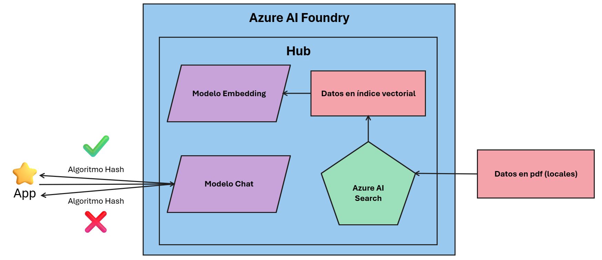
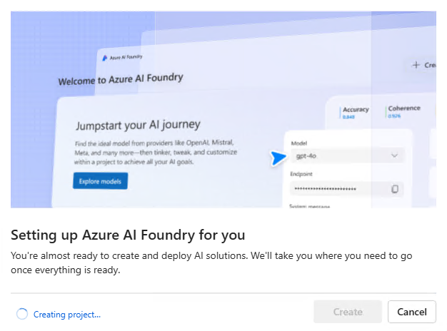
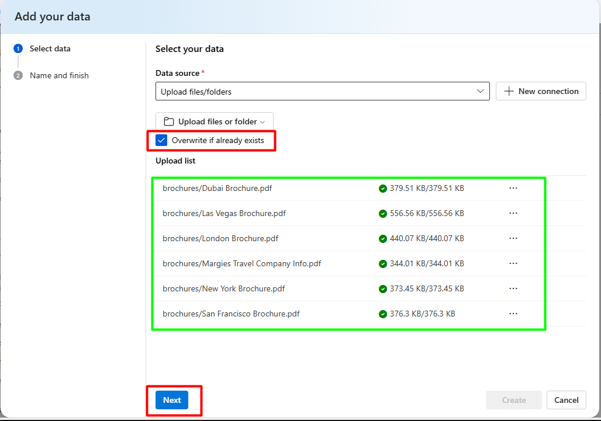

#  Construir pipeline básico de ingestión → indexación → consulta RAG (usar datasets de prueba y validar sanitización)

## Objetivo de la práctica:

Al finalizar la práctica, serás capaz de:

- Construir un pipeline de ingestión, indexación y consulta RAG usando Azure AI Foundry y Azure Cognitive Search.
- Subir y vectorizar documentos, crear índices y desplegar modelos de embedding y generación para consultas integradas.
- Validar la sanitización e integridad de datos mediante algoritmos hash y simular ataques para comprobar detección y bloqueo.

## Diagrama del laboratorio 
El siguiente diagrama resume visualmente lo que realizarás a lo largo de la siguiente práctica. 



## Duración aproximada:
- 60 minutos.

## Instrucciones 
RAG (Retrieval-Augmented Generation) es una técnica que combina modelos de lenguaje con mecanismos de recuperación de información para generar respuestas más precisas y actualizadas. En lugar de depender únicamente del conocimiento entrenado del modelo, RAG permite consultar fuentes externas, como bases de datos o documentos, para enriquecer las respuestas con información relevante y contextual. En Azure AI Foundry, RAG se implementa integrando servicios como Azure Cognitive Search y Azure OpenAI, lo que permite a las organizaciones construir soluciones de IA generativa que aprovechan sus propios datos privados de forma segura y escalable.

Este laboratorio muestra cómo usar Azure AI Foundry para construir una aplicación generativa que integra datos propios usando el patrón RAG (Retrieval-Augmented Generation): subir documentos, crear un índice vectorial, y usar ese índice para “groundear” respuestas generadas por un LLM. Finalmente, sanatizar los datos para verificar su integridad con algoritmos hash. 


### Tarea 1. Acceder al entorno del laboratorio.

**Paso 1.** Desde tu equipo accede al servicio de Escritorio remoto. La dirección IP y las credenciales será proporcionadas por tu insturctor. 


---

### Tarea 2. Iniciar sesión en Azure AI Foundry.

**Paso 1.** Abre el navegador Microsoft Edge desde el escritorio remoto.


---

**Paso 2.** Navega a la URL de Azure AI Foundry: https://aifoundry.azure.com/


---

**Paso 3.** Inicia sesión con las credenciales proporcionadas por tu instructor.


### Tarea 3. Crear un proyecto y un Hub en Azure AI Foundry.

**Paso 1.** En la parte superior haz clic en **All resources**.


---

**Paso 2.** Haz clic en **Create new**.


---

**Paso 3.** Cambia la opción predeterminada y recomendada por **AI Hub resource**.


---

**Paso 4.** IDeja los valores por Default y haz clic en **Create**.


---

**Paso 5.** Espera a la creación del proyecto y el Hub. 



---

### Tarea 5. Crear los Deployments necesarios para el RAG

**Paso 1.** Una vez creado el Hub, dirigete al costado inferior del panel izquierdo, y selecciona la opción **Models + endpoints** ubicada en la sección **My assets**. 

Luego, haz clic en **+ Deploy model** y finalmente en la opción **Deploy base model**.


---

**Paso 2.** En la ventana emergente, busca y selecciona el modelo **text-embedding-ada-002** y haz clic en **Confirm**.


---

**Paso 3.** Observa el ***Resource location*** donde se creará el deployment, no hagas modificaciones, y haz clic en el botón **Deploy**.


---

**Paso 4.** Regresa a la ventana princopal de **Models + endpoints**, ya deberías ver listado el deployment del modelo text-embedding-ada-002.

Repite los pasos anteriores de esta tarea para desplegar el modelo **gpt-4o**.


**IMPORTANTE** Si al hacer clic en el botón **Deploy** aparece una nueva ventana que te solicita crear un recurso en una región diferente a la del modelo anterior, no lo crees y consultalo con tu instructor.

Si esto no sucede, omite esta nota. 


Felicitaciones, deberías 

### Tarea 6. Configurar indices y vectores con datos de ejemplo

**Paso 1.** Abre una nueva pestaña en tu navegador, y accede a la siguiente URL. Esto deberá descargar un archivo comprimido **.zip**.

`https://github.com/MicrosoftLearning/mslearn-ai-studio/raw/main/data/brochures.zip`


---

**Paso 2.** Abre el archivo haciendo clic en este en la ventana de confirmación de descarga en el navegador, o accede a la carpeta **Downloads** de tu máquina virtual Windows. 

Una vez accedas al archivo, haz clic en el botón **Extract all** que aparece en la parte superior de la ventana. 


---

**Paso 3.** Extrae los archivos haciendo clic en el botón **Extract** de la ventana emergente. 


---

**Paso 4.** Regresa a la pestaña del navegador donde tienes abierto Azure AI Foundry. Busca la opción **Data + indexes** en el panel izquierdo y accede a ella. Una vez adentro, haz clic en **+New data**.


---

**Paso 5.** En la ventana emergente, selecciona la opción `Upload files/fikders` en **Data source** y haz clic en **Upload files or folders** y luego en **Upload folder**.


---

**Paso 6.** En la ventana emergente navega a la carpeta donde extrajiste los archivos del paso 3, selecciona la carpeta **brochures** y haz clic en el botón **Upload**.


---

**Paso 7.** Haz clic en el botón **Upload** del mensaje desplegado en el navegador.


---

**Paso 8.** Una vez cargados los archivos, selecciona la opción **Overwrite if already exists** y haz clic en el botón **Next**.



---

**Paso 9.** Configura el **Data name** como `brochures` en esta ventana, y finaliza con el botón **Create**.


---

**Paso 10.** Una vez creado el dataset, verifica que los archivios en pdf se hayan cargado correctamente. Ahora dirígete a la ventana principal del **Data + indexes**.


---

**Paso 11.** Haz clic en la pestaña **Indexes** y luego en el botón **+ New index**.


---

**Paso 12.** En la ventana emergente, despliega las opciones de **Data source** y elige `Data in Azure AI Foundry`, luego selecciona el dataset `brochures` creado anteriormente y haz clic en el botón **Next**.


---

**Paso 13.** En esta ventana debes seleccionar el servicio indexador. Para crear uno nuevo haz clic en **Create a new Azure AI Search resource**.


---

**Paso 14.** Se abrirá una nueva pestaña en el navegador con el portal de Azure listo para crear el servicio Search. COnfigura las siguientes opciones:

- Subscription: Usa la única suscripción disponible.
- Resource group: Usa el grupo de recursos que aparece por defecto.
- Service name: Asigna un nombre único al servicio search, por ejemplo `ragsearch<tu-iniciales>`.
- Region: Usa la misma región que observaste anteriormente en los Deployment.
- Pricing ties: Haz clic en **Change Pricing Tier**.


---

**Paso 15.** Selecciona la opción **B Basic** y haz clic en el botón **Select**.


---

**Paso 16.** Haz clic en el botón **Review + create** y luego en **Create** para iniciar la creación del servicio Search.


---

**Paso 17.** Espera a la creación del recurso, hasta que aparezca la ventana de confirmación **Your deployment is complete**.


---

**Paso 18.** Regresa a la pestaña del navegador donde estás creando el índice vectorial, despliega las opciones de **Select Azure AI Search service** y elige **Connect other Azure AI Search resource**.


---

**Paso 19.** Selecciona el recurso que previamente creaste y haz clic en el botón **Add connection**.


---

**Paso 20.** En **Vector index** escribe `brochures-index` y haz clic en **Next**.


---

**Paso 21.** En esta ventana, selecciona la conexión a Azure OpenAI que creaste, el modelo embedding y el deployment del modelo embedding. 


Luego, haz clic en el botón **Next**.

---

**Paso 22.** Finalmente, haz clic en el botón **Create** para crear el índice vectorial.


---

**Paso 23.** La creación total del indice puede tardar varios minutos, actualmente está en estatus **Running**, al final deberá estar en estatus **Completed**. 

Puedes avanzar a la siguiente tarea mientras esto sucede. 


### Tarea 7. Configurar la aplicación que consumirá el modelo con tus datos

**Paso 1.** En tu máquina virtual Windows, haz clic en **Inicio** y luego busca `PowerShell` y ejecutalo como administrador.


---

**Paso 2.** En la ventana de PowerShell accede a la carpeta del laboratorio, ejecutando el siguiente comando:

```powershell
cd "$env:USERPROFILE\Desktop\Lab Files\python\"
```

 Luego ejecuta este otro comando para crear un entorno aislado.

```powershell
 python -m venv labenv
```


---

**Paso 3.** Accede al entorno aislado.

```powershell
.\labenv\Scripts\Activate.ps1
```


---

**Paso 4.** Instala las librerías necesarias para el laboratorio ejecutando el siguiente comando:

```powershell
pip install -r requirements.txt
```


---

**Paso 5.** En el escritorio de tu máquina Windows, abre la carpeta **LabFiles**, accede a la carpeta **python** y abre con el bloc de notas el archivo **.env**. Este archivo contendrá los endpoints y variables para acceder a los recursos creados en Azure. 

**Recomendación** En un escenario real, las claves deben almacenarse de forma segura, usando servicios como: AWS Secrets Manager, Azure Key Vault, HashiCorp Vault, etc.


---

**Paso 6.** Regresa a la pestaña del navegador donde tienes abierto Azure AI Foundry. Verifica que tu indice vectorial ahora esté en estado **Completed**, si aún no lo está, espera un momento más antes de pasar a la siguiente parte del laboratorio. 

---

**Paso 7.** Una vez que tu indice vectorial esté en estatus **Completed**, dirigete a opción **Overview** del panel izquierdo.


---

**Paso 8.** En la sección **Included capabilities**, selecciona **Azure OpenAI**, copia el valor del **Azure OpenAI endpoint** y pégalo entre las comillas dobles del archivo **.env** frente a OPEN_AI_ENDPOINT.


---

**Paso 9.** Regresa a la pestaña del navegador donde tienes abierto Azure AI Foundry. Y ahora copia y pega el **API Key** frente a OPEN_AI_KEY de tu archivo **.env**.


---

**Paso 10.** Ahora dirígete a la opción **Models + endpoints** en el panel izquierdo, y copia y pega el nombre del modelo del chat y del embeddning respectivamente donde corresponde en el archivo **.env**.


---

**Paso 11.** Ahora regresa a la pestaña del navegador del portal del Azure donde habías creado el recurso de AI Search, y usa la barra de búsqueda superior para buscar `AI Search`.


---

**Paso 12.** Selecciona el recurso de AI Search que creaste anteriormente.


---

**Paso 13.** En el menú lateral izquierdo, asegurate que estás en **Overview**, en esta ventana verás la URL del servicio, copiala y pégala donde corresponde en el archivo **.env**.


---

**Paso 14.** Ahora haz clic en la opción **Keys** que se encuentra en la sección **Settings** en el menú lateral izquierdo, copia la Primary admin Key y pégala donde corresponde en el archivo **.env**.


---

**Paso 15.** Finalmente, en el archivo **.env**, en la variable INDEX_NAME, escribe el nombre del índice vectorial que creaste anteriormente: `brochures-index`.

Puedes asegurarte que ese sea el nombre accediendo a la sección **Search management** del menú lateral izquierdo y seleccionando la opción **Indexes**.


---

**Paso 16.** Tu archivo **.env** ahora debería tener un aspecto similar a este:


Ahora guárdalo y ciérralo.


### Tarea 8. Ejecutar y probar la aplicación con respuestas integras y seguras

**Paso 1.** Regresa a la ventana de PowerShell y ejecuta el siguiente comando para iniciar la aplicación:

```powershell
python rag-app.py
```


---

**Paso 2.** Una vez iniciada la aplicación, escribe la siguiente pregunta y presiona Enter:

`*¿Dónde me puedo hospedar en Nueva York?`


---

### Resultado final

¡Felicidades! Lo has logrado. La aplicación valida, con algoritmos hash, que la solicitud y la respuesta no haya sido modificada. Observa la respuesta generada por el modelo, puedes consultar los archivos pdf, y verás que coinciden con la información extraida de los datos indexados y vectorizados.


Ahora prueba ejecutando un script malicioso de ejemplo para ver qué sucedería si se intenta modificar la respuesta. 

En la ventana de Powershell escribe la palabra `quit` para detener la ejecución de la aplicación. 

Ejecuta la aplicación corrompida, con el siguiente comando:

```powershell
python attack_simulator.py
```


Una vez iniciada la aplicación, escribe la siguiente pregunta y presiona Enter:

`*¿Dónde me puedo hospedar en Nueva York?`


Observa que la respuesta generada por el modelo ha sido modificada, es decir, el hash de la respuesta no coincide con el hash original, lo que indica que la integridad de los datos ha sido comprometida. Por lo cual la sesión se bloquea por amenaza. 

